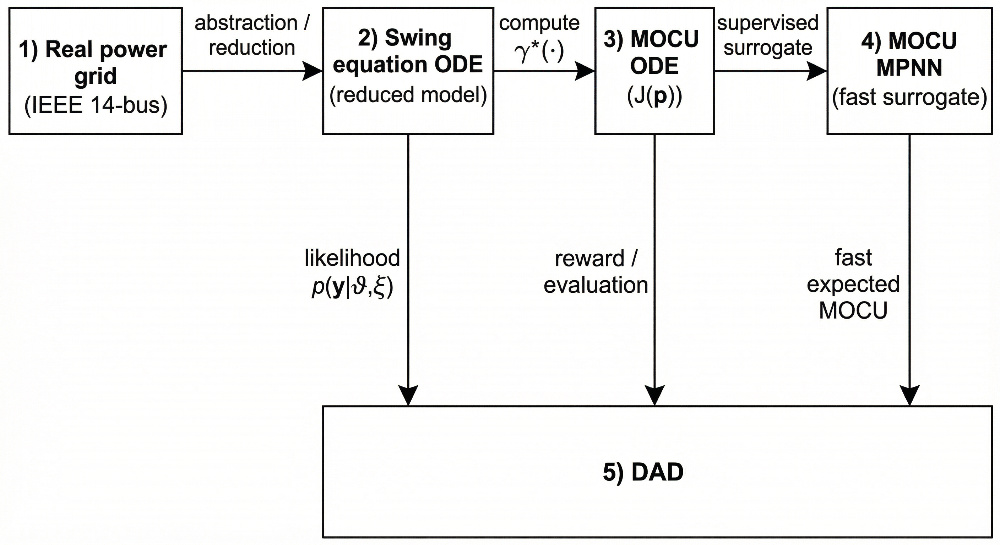
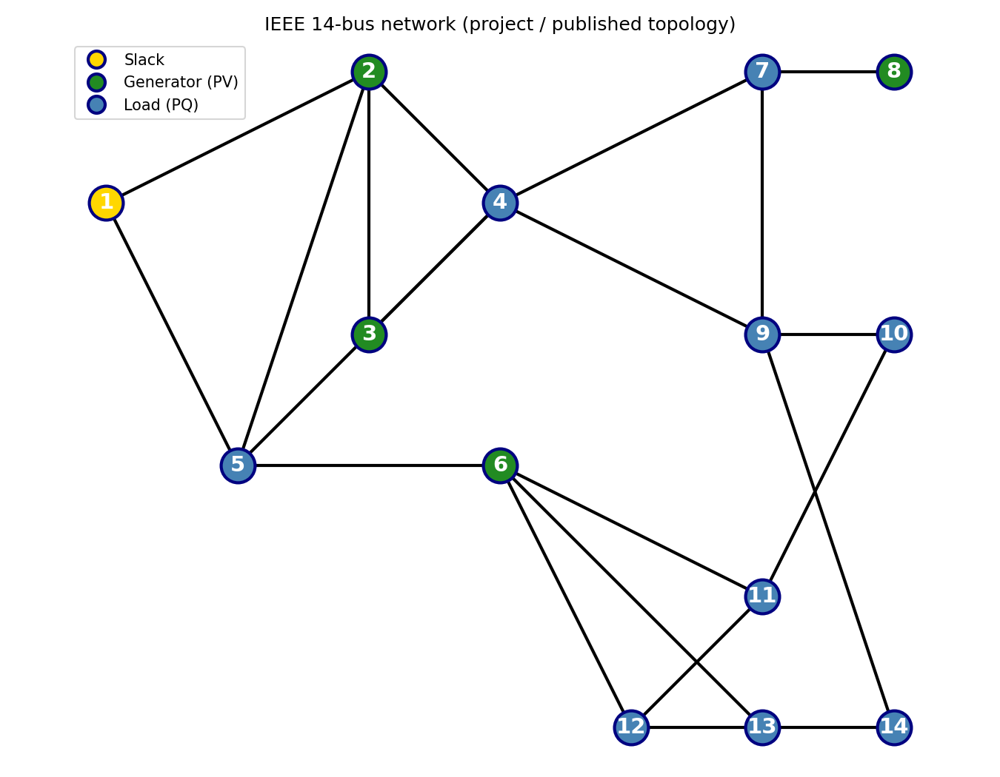

# DAD-MOCU: Design Document

**Sequential Optimal Experimental Design for Power Systems**

*Gaoming Lin · Advisor: Dr. Byung-Jun Yoon · January 2026*

*This document is the prototype for the project paper. Keep design_github.md in sync when editing.*

---

## 1. Introduction and Goal

This document describes the design of a **sequential Bayesian optimal experimental design (sBOED)** framework for power systems. The system is modeled by the **second-order Kuramoto (swing) equation** on an IEEE-14 bus network. The goal is to design **active probing experiments** that reduce uncertainty in a **decision-relevant quantity**—the minimal safe gain $\gamma^{\ast}(M,K)$—rather than estimating parameters $(M,K)$ for their own sake. The framework uses **Mean Objective Cost of Uncertainty (MOCU)** as the utility and trains a **Deep Adaptive Design (DAD)** policy to select probes non-myopically.

---

## High-level pipeline

Conceptual flow from the physical grid to the DAD policy: **real power grid** → **swing equation ODE** → **MOCU (ODE)** → **MOCU estimation with MPNN** → **DAD**. The swing ODE provides the **likelihood** $p(y \mid \vartheta, \xi)$ (via $\mathrm{Map}(\vartheta, \xi)$); the **posterior** $p(\vartheta \mid y, \xi)$ is computed by Bayes’ rule in §5.

```mermaid
flowchart TB
    subgraph P1["1. Real power grid"]
        G["IEEE 14-bus\nvoltages, currents\nSimulink / Simscape"]
    end
    subgraph P2["2. Swing equation ODE"]
        S["Reduced model θ, ω\nM dω/dt = P_m − Σ B_ij sin(θ_i−θ_j) − Dω − Kω + u"]
    end
    subgraph P3["3. MOCU (ODE)"]
        M["Cost J(γ,ϑ)=|γ−γ*|; MOCU(p)=E[J(γ̂(p),ϑ)]\nGround-truth via ODE"]
    end
    subgraph P4["4. MOCU estimation with MPNN"]
        MP["Ĵ(p) ≈ MPNN(state, graph)\nFast surrogate"]
    end
    subgraph P5["5. DAD"]
        D["Policy π_φ(h) → ξ_t\nREINFORCE, terminal MOCU"]
    end
    G -->|abstraction / reduction| S
    S -->|compute γ*, γ̂, MOCU| M
    M -->|supervised surrogate| MP
    S -->|likelihood p(y|ϑ,ξ)| D
    M -->|reward / evaluation| D
    MP -->|fast expected MOCU| D
```

<div align="center">

</div>

The full chain **observation → likelihood → posterior → cost → MOCU** is defined in **§5**.

---

## 2. System Model and Dynamics

### 2.1 Network Topology (IEEE 14-Bus Standard)

The system topology is fixed and defined by the standard IEEE 14-bus test case (Texas A&M University, n.d.). We assume **homogeneous** uncertain parameters: $M_i = M$ and $K_i = K$ for all buses $i$, so the latent parameter vector is $\vartheta = (M, K)$ (scalar $M$, $K$).
* **Bus Set ($\mathcal{V}$):** The set of $N=14$ buses, indexed $i \in \{1, \dots, 14\}$.
* **Branch Set ($\mathcal{E}$):** The specific set of 20 transmission lines and transformers as defined in the standard IEEE 14-bus data. A physical line exists between bus $i$ and $j$ if $(i, j) \in \mathcal{E}$.
* **Coupling Structure:** The network connectivity is encoded in the **Susceptance Matrix** $\mathbf{B} \in \mathbb{R}^{N \times N}$. The entry $B_{ij} > 0$ represents the magnitude of the line susceptance if $(i, j) \in \mathcal{E}$, and $B_{ij} = 0$ otherwise.

**Node types (standard power-system classification):**

| Type | Buses | Role |
|------|--------|------|
| **Slack** | 1 | Reference (angle/frequency); balances real/reactive power. |
| **Generator (PV)** | 2, 3, 6, 8 | Voltage-controlled; inject real power. *PV* = real power P and voltage magnitude V specified. |
| **Load (PQ)** | 4, 5, 7, 9, 10, 11, 12, 13, 14 | Consume P and Q. *PQ* = real and reactive power (P, Q) specified. |

**Background (P and Q):** In AC power systems, **P** (real power) does useful work; **Q** (reactive power) supports voltage and fields. In power-flow, at a **PV bus** (generator) $P$ and $|V|$ are specified; at a **PQ bus** (load) $P$ and $Q$ are specified; the **slack** bus sets $|V|$ and $\theta$ and solves for $P$, $Q$ to balance the system. The swing-equation model below focuses on frequency dynamics; the above classification guides where to probe.

**Connectivity:** The IEEE 14-bus topology is shown below. Bus 4 is the only degree-5 node (hub); buses 2, 5, 6, 9 have degree 4. Symmetric pairs (10, 14) and (11, 13) have identical connectivity and yield identical design outcomes for the same probe amplitude. Node colors: gold = slack (bus 1), green = generator (2, 3, 6, 8), blue = load (rest).

<div align="center">

</div>

**Experiment design preference:** For maximum information (M/K estimation), prefer high-degree buses: **4** (hub), then **2, 5, 6, 9**. To cover node types use **1** (slack), **2** or **3** (gen), **4** (load hub), **7** (load), and **10** or **14** (load). For minimal redundancy, use one from each symmetric pair (e.g. 10 and 13, or 14 and 11).

### 2.2 Swing Equation (Second-Order Kuramoto Model)

The system state at time $t$ is $\mathbf{x}(t) = [\boldsymbol{\theta}(t), \boldsymbol{\omega}(t)]^\top \in \mathbb{R}^{2N}$. The dynamics follow the **Second-Order Kuramoto Model** (Swing Equation), adapted for structure-preserving power networks.

For each bus $i \in \mathcal{V}$:

$$
\dot{\theta}_i(t) = \omega_i(t)
$$

$$
M_i \dot{\omega}_i(t) = P_{m,i} - P_{e,i}(\boldsymbol{\theta}(t)) - (D_i + K_i)\omega_i(t) + u_i(t)
$$

**Injection $u_i(t)$:** There are only two terms: $u_i(t) = u^{\mathrm{probe}}_i(t) + u^{\mathrm{ctrl}}_i(t)$ (no separate “$u^{\mathrm{ref}}$”).
* **$u^{\mathrm{probe}}_i$ (probe):** Same formula everywhere (e.g. Hann window at a bus). Its *parameters* depend on context: (a) In the **sBOED loop** we set $u^{\mathrm{probe}}$ from the chosen design $\xi_t = (b_t, A_t, T_p)$ so we get the observation $y_t = \mathrm{Map}(\vartheta_{\mathrm{true}}, \xi_t) + \epsilon_t$. (b) When evaluating $\gamma^{\ast}(\vartheta)$ we set $u^{\mathrm{probe}}$ to a **reference** (fixed bus, amplitude, duration) so the ODE is under a fixed disturbance; then we find the smallest $\gamma$ such that constraints hold. So “reference contingency” = $u^{\mathrm{probe}}$ with fixed reference parameters; it is not a third injection type.
* **$u^{\mathrm{ctrl}}_i$ (control):** $u^{\mathrm{ctrl}}_i = \gamma\, g_i\, \omega_i(t)$. Used when we evaluate $\gamma^{\ast}$ (candidate $\gamma$) and when we deploy. **Not** used during the observation step of the sBOED loop: in the loop we only apply the probe to measure ROCOF; we do not apply control.

**Two uses of the swing ODE (do not confuse):**
1. **Observation (sBOED loop):** Solve ODE with $\vartheta$, $u^{\mathrm{probe}}$ from design $\xi_t$, and **no** $u^{\mathrm{ctrl}}$ (or $\gamma=0$). Result → ROCOF → $y_t = \mathrm{Map}(\vartheta, \xi_t) + \epsilon_t$. So in the loop there is only $u^{\mathrm{probe}}$ for the observation.
2. **$\gamma^{\ast}$ evaluation:** Solve ODE with $\vartheta$, $u^{\mathrm{probe}}$ set to the **reference** (fixed bus/amplitude/duration), and $u^{\mathrm{ctrl}} = \gamma g_i \omega_i$ for candidate $\gamma$. Find smallest $\gamma$ such that $|\dot{f}| \le r_{\max}$ and $f \ge f_{\min}$. If we run with no $u^{\mathrm{probe}}$ and no $u^{\mathrm{ctrl}}$ here, $\gamma^{\ast}$ is trivially 0 and MOCU collapses.

**Where the electrical power flow $P_{e,i}$ is:**
$$
P_{e,i}(\boldsymbol{\theta}(t)) = \sum_{j \in \mathcal{N}_i} B_{ij} \sin\bigl(\theta_i(t) - \theta_j(t)\bigr)
$$
(Note: the set of neighbors for bus $i$ is $\mathcal{N}_i = \lbrace j \mid (i, j) \in \mathcal{E} \rbrace $.)

### 2.3 Notation and Units

| Symbol | Definition | Unit / Domain |
| :--- | :--- | :--- |
| $\theta_i$ | Voltage phase angle at bus $i$. | Rad |
| $\omega_i$ | Angular frequency deviation from synchronous speed $\omega_s$. | Rad/s |
| $P_{m,i}$ | Net mechanical power injection (Generation - Load). | p.u. |
| $B_{ij}$ | Line susceptance magnitude between bus $i$ and $j$. | p.u. |
| $D_i$ | Load-damping coefficient (frequency sensitivity). | p.u. |
| $u_i(t)$ | Total injection: $u^{\mathrm{probe}}_i + u^{\mathrm{ctrl}}_i$ (probe + control). | p.u. |
| **Latent $\vartheta$** | **Uncertain Parameters** | |
| $M_i$ ($M$) | **Effective Inertia Coefficient** (homogeneous). $M = 2H/\omega_s$, $\omega_s = 2\pi f_0$. | $s^2/\mathrm{rad}$ |
| $K_i$ ($K$) | **Primary frequency response (droop) gain** (homogeneous $K_i{=}K$). Governor/FFR gain. | p.u. |

### 2.4 Latent Space Prior
The parameter vector $\vartheta = (M, K)$ has a **uniform prior** $p(\vartheta)$ over a physically validated rectangle. Here $M$ is the effective inertia coefficient, $M = 2H/\omega_s$ with $\omega_s = 2\pi f_0$ (nominal frequency; implementation uses 50 Hz, ENTSO-E).
* **Inertia ($M$):** $[0.01,\, 0.06]$ $s^2/\mathrm{rad}$ (corresponds to $H \in [2.3,\, 5.0]$ s at $\omega_s = 2\pi f_0$; Kundur, 1994).
* **Droop gain ($K$):** $[0.05,\, 0.50]$ p.u. (Dörfler & Bullo, 2012; NERC/ERCOT.)

---

## 3. Decision Objective: Minimal Safe Gain

We aim to estimate the **Minimal Safe Gain** $\gamma^{\ast}$, defined as the smallest control effort (gain $\gamma$) such that the system stays secure **under a reference contingency**. The **reference contingency** is a fixed disturbance scenario (e.g. load step, or a reference probe with chosen amplitude) used *only* when evaluating $\gamma^{\ast}$—it is the scenario under which we require ROCOF and frequency limits to hold. It is *not* the same as the small identification probe $\xi$ used in experiments (the latter is for learning; the reference contingency is for defining “minimal safe” control). Here $f(t)$ and $\dot{f}(t)$ denote (e.g.) the system frequency and ROCOF at a reference bus or the worst case over buses.

$$
\gamma^{\ast}(\vartheta) = \inf \left\lbrace \gamma \in \mathbb{R}_+ \mid \text{under the reference contingency, } \forall t:\; \lvert \dot{f}(t) \rvert \le r_{\max} \land f(t) \ge f_{\min} \right\rbrace
$$

**Security constraints:** ROCOF limit $r_{\max} = 0.1$ Hz/s; frequency nadir $f(t) \ge f_{\min}$ (e.g. $f_{\min} = 49.8$ Hz at 50 Hz nominal, or 59.8 Hz at 60 Hz).

**What is “safe gain”?** The gain $\gamma$ is for the **proportional frequency-feedback control** $u^{\mathrm{ctrl}}_i = \gamma\, g_i\, \omega_i$ (primary frequency response): it is the scalar that scales how much power is injected in response to frequency deviation $\omega_i$ at each bus (with shape $g_i$). A *safe gain* is a $\gamma$ such that under a given contingency the system satisfies the security limits above (ROCOF $\le r_{\max}$, frequency $\ge f_{\min}$). The *minimal* safe gain $\gamma^\ast(\vartheta)$ is the smallest such $\gamma$—the minimum control effort needed to keep the system secure for that scenario and parameter $\vartheta$. The notion is standard in power systems: security is defined by frequency and ROCOF limits (e.g. ENTSO-E network codes, NERC frequency response standards), and “minimum gain to meet specifications” is a common control-design objective (e.g. Kundur, 1994; primary frequency response and droop, Dörfler & Bullo, 2012; NERC BAL-001-TRE-2). Our $r_{\max}$, $f_{\min}$ choices follow ENTSO-E/IGD and typical practice (see **documents/Parameter_references_table.md**; Kundur, 1994; ENTSO-E, 2020; NASPI, 2021).

**Exact math and code:** The dynamics, reference contingency, and $\gamma^{\ast}$ computation are in **documents/gamma_star_and_mocu_math.md**. The code computes $\gamma^{\ast}$ by binary search on the ODE **with the reference contingency** included in the ODE; if no reference contingency is applied, $\gamma^{\ast}$ is trivially 0 and MOCU is degenerate. The chain **observation → likelihood → posterior → cost → MOCU** is in §5.

---

## 4. The Experiment-to-Observation Pipeline

This section details how a **probe** $\xi = (b, A, T_p)$ (bus $b$, amplitude $A$, duration $T_p$) is transformed into a scalar observation $y$. The process involves three mapping stages: **Dynamics ($\Phi$)**, **Sampling ($\mathcal{S}$)**, and **Feature Extraction ($\Psi$)**.

### 4.1 Pipeline Overview

```text
       [1. Dynamics]               [2. Sampling]              [3. Feature Extraction]
      (Continuous ODE)           (Discrete Measurement)           (Max-Pooling)

 u(t) ---> [ SYSTEM ] -- w(t) --> [ PMU SENSOR ] -- f[n] --> [ CALCULATE ROCOF ] -- y -->
             ^                         ^                            ^
             |                         |                            |
        Parameters (M,K)          Noise (eta)                  Max(|df/dt|)
```

### 4.2 Dynamics, Sampling, and Feature Extraction

**Stage 1: Dynamics (solution map $\Phi$)**  
Given $\vartheta$ and $\xi = (b, A, T_p)$, the probe at bus $b$ is $u_b(t) = A \cdot \tfrac{1}{2}(1 - \cos(2\pi t/T_p))$ for $t \le T_p$, and $0$ elsewhere (Hann window); $u_i(t)=0$ for $i \neq b$. We solve the swing ODE to get $\mathbf{x}(t) = [\boldsymbol{\theta}(t), \boldsymbol{\omega}(t)]^\top$:
$$
\mathbf{x}(t) = \Phi_t(\mathbf{x}_0, \vartheta, u^{\mathrm{probe}}_{\xi}), \quad t \in [0, T_{\mathrm{obs}}].
$$

**Stage 2: Discrete Sampling (The Measurement Map $\mathcal{S}$)**
We sample the frequency deviation $\Delta f_i(t) = \omega_i(t)/2\pi$ at $f_s = 12$ Hz.
$$
\tilde{f}_i[n] = \Delta f_i(n \cdot \Delta t) + \eta_n, \quad \Delta t = 1/f_s
$$
* $\eta_n$: Measurement noise (negligible).

**Stage 3: Feature Extraction (The Reduction Map $\Psi$)**
We compute the discrete Rate of Change of Frequency (ROCOF) and pool it into a single scalar statistic $y$.
1.  **Finite Difference:** $\mathrm{ROCOF}_i[n] = (\tilde{f}_i[n] - \tilde{f}_i[n-1]) / \Delta t$
2.  **Max-Pooling:**

$$
y = \Psi(\tilde{\mathbf{f}}) = \max_{i, n} \lvert \mathrm{ROCOF}_i[n] \rvert
$$

### 4.3 The Forward Map (Map)
We define the composite forward map $\mathrm{Map}(\vartheta, \xi)$ as the deterministic output of this entire pipeline (excluding noise). The final observation $y$ is:
$$
y = \mathrm{Map}(\vartheta, \xi) + \epsilon, \quad \epsilon \sim \mathcal{N}(0, \sigma_{\mathrm{feat}}^2)
$$
* **$\sigma_{\mathrm{feat}}$:** Observation noise (Hz/s); default 0.05 (aggregate numerical and PMU uncertainty; NASPI, 2021). Defined in §9.

---

## 5. Scientific process: observation → likelihood → posterior → cost → MOCU

This section gives the full mathematical chain from the observation model to the MOCU objective, with references (Boluki et al., 2018; Imani et al., 2018; Foster et al., 2021).

### 5.1 Observation model

The scalar observation is the max ROCOF from the pipeline in §4, with additive Gaussian noise:
$$
y = \mathrm{Map}(\vartheta, \xi) + \epsilon, \qquad \epsilon \sim \mathcal{N}(0, \sigma_{\mathrm{feat}}^2).
$$
Here $\mathrm{Map}(\vartheta, \xi)$ is the deterministic output of: solve swing ODE with $\vartheta$ and probe $\xi$ → sample frequency at $f_s = 12$ Hz → compute ROCOF → take max over buses and time. The noise $\epsilon$ aggregates measurement and numerical uncertainty ($\sigma_{\mathrm{feat}} = 0.05$ Hz/s by default; §9).

### 5.2 Likelihood

Given parameters $\vartheta$ and design $\xi$, the observation $y$ is Gaussian around $\mathrm{Map}(\vartheta, \xi)$:
$$
p(y \mid \vartheta, \xi) = \frac{1}{\sqrt{2\pi\sigma_{\mathrm{feat}}^2}} \exp\left( -\frac{\bigl(y - \mathrm{Map}(\vartheta, \xi)\bigr)^2}{2\sigma_{\mathrm{feat}}^2} \right).
$$
Implementation: $\mathrm{Map}(\vartheta, \xi)$ is computed by solving the swing ODE then applying the sampling and ROCOF max-pool in §4.2–4.3.

### 5.3 Prior

$p(\vartheta)$ is uniform over $[M_{\min}, M_{\max}] \times [K_{\min}, K_{\max}]$ (see §2.4): constant on that rectangle, zero outside.

### 5.4 Posterior (Bayes’ rule)

After observing $y_{\mathrm{obs}}$ under design $\xi$, the posterior is
$$
p(\vartheta \mid y_{\mathrm{obs}}, \xi) = \frac{p(y_{\mathrm{obs}} \mid \vartheta, \xi)\, p(\vartheta)}{Z}, \qquad Z = \int p(y_{\mathrm{obs}} \mid \vartheta', \xi)\, p(\vartheta')\, d\vartheta'.
$$
With a uniform prior, $p(\vartheta \mid y_{\mathrm{obs}}, \xi) \propto p(y_{\mathrm{obs}} \mid \vartheta, \xi)$ on the prior support; $Z$ is the normalizing integral.

### 5.5 Posterior computation on a grid

We approximate the posterior by a discrete distribution on an $n_{\mathrm{grid}} \times n_{\mathrm{grid}}$ grid over $(M, K)$:

1. **Grid:** $(M_i, K_j)$ with $M_i \in [M_{\min}, M_{\max}]$, $K_j \in [K_{\min}, K_{\max}]$.
2. **Log-likelihood:** For each $(M_i, K_j)$, compute $\mathrm{Map}(\vartheta_{ij}, \xi)$ (ODE solve), then $\ell_{ij} = \log p(y_{\mathrm{obs}} \mid \vartheta_{ij}, \xi)$.
3. **Stability:** $\ell_{ij} \leftarrow \ell_{ij} - \max_{i,j} \ell_{ij}$.
4. **Unnormalized:** $q_{ij} = \exp(\ell_{ij})$.
5. **Normalize:** $p_{ij} = q_{ij} / \sum_{i,j} q_{ij}$ → discrete posterior $p(M_i, K_j \mid y_{\mathrm{obs}}, \xi)$.
6. **Marginals:** $p(M_i \mid y, \xi) = \sum_j p_{ij}$, $p(K_j \mid y, \xi) = \sum_i p_{ij}$ (each renormalized).

### 5.6 Sequential belief update

At step $t$, the belief *before* the observation is $p_{t-1}(\vartheta)$; after observing $y_t$ from design $\xi_t$, the belief updates via Bayes:
$$
p_t(\vartheta) \propto p(y_t \mid \vartheta, \xi_t)\, p_{t-1}(\vartheta), \qquad Z_t = \int p(y_t \mid \vartheta', \xi_t)\, p_{t-1}(\vartheta')\, d\vartheta', \quad p_t(\vartheta) = \frac{p(y_t \mid \vartheta, \xi_t)\, p_{t-1}(\vartheta)}{Z_t}.
$$
So $p_0$ is the prior; $p_t$ is the belief *after* step $t$ (consistent with `documents/pseudocode.tex`). For a discrete representation (grid or particles), the denominator $Z_t$ is the sum over the support; the implementation uses a log-domain (log-sum-exp) update for numerical stability (see pseudocode §Posterior update and numerical stability).

### 5.7 Operational cost $J(\gamma, \vartheta)$

The operator must choose a single control gain $\gamma \in \mathbb{R}_+$ to deploy (e.g. for frequency response). Too low $\gamma$ → risk of violating ROCOF/frequency limits; too high $\gamma$ → excess capacity or cost. We define the **operational cost** (objective cost) when the operator deploys $\gamma$ and the true system is $\vartheta$ as
$$
J(\gamma, \vartheta) = \bigl\lvert \gamma - \gamma^{\ast}(\vartheta) \bigr\rvert.
$$
Interpretation: over-provision $\gamma > \gamma^{\ast}(\vartheta)$ costs $\gamma - \gamma^{\ast}(\vartheta)$; under-provision $\gamma < \gamma^{\ast}(\vartheta)$ costs $\gamma^{\ast}(\vartheta) - \gamma$. For fixed $\vartheta$, the minimizer is $\gamma^{\ast}(\vartheta)$ (the minimal safe gain in §3). This $L_1$ form gives the Bayes-optimal decision under belief as the median (e.g. Ferguson, 1967).

### 5.8 Bayes-optimal decision $\hat{\gamma}(p)$

Given belief $p(\vartheta)$, the optimal deployed gain minimizes expected cost:
$$
\hat{\gamma}(p) = \arg\min_{\gamma \ge 0} \mathbb{E}_{\vartheta \sim p}\bigl[ J(\gamma, \vartheta) \bigr] = \arg\min_{\gamma \ge 0} \mathbb{E}_{\vartheta \sim p}\bigl[ \lvert \gamma - \gamma^{\ast}(\vartheta) \rvert \bigr].
$$
For this cost, the minimizer is the **median** of $\gamma^{\ast}(\vartheta)$ under $p$:
$$
\hat{\gamma}(p) = \mathrm{median}_{\vartheta \sim p} \bigl[ \gamma^{\ast}(\vartheta) \bigr].
$$

### 5.9 MOCU $(p)$ — mean objective cost of uncertainty

**MOCU** is the **expected objective cost of uncertainty** under belief $p$: the expected cost we incur by deploying the Bayes decision $\hat{\gamma}(p)$ when the true system is $\vartheta$ (Boluki et al., 2018; Imani et al., 2018). That is,
$$
\mathrm{MOCU}(p) = \mathbb{E}_{\vartheta \sim p}\bigl[\, J(\hat{\gamma}(p), \vartheta) \,\bigr] = \mathbb{E}_{\vartheta \sim p}\bigl[\, \bigl\lvert \gamma^{\ast}(\vartheta) - \hat{\gamma}(p) \bigr\rvert \,\bigr].
$$
So: **$J(\gamma, \vartheta)$ is the cost** (operational cost); **$\mathrm{MOCU}(p)$ is the MOCU** (expected cost under belief $p$). This is the only MOCU formula used in this framework.

### 5.10 Design objective (risk)

To select the optimal next probe $\xi^{\ast}$, we minimize the **risk** (expected MOCU after the experiment):
$$
\mathcal{R}(\xi; p_t) = \mathbb{E}_{y \sim p(y \mid p_t, \xi)} \left[ \mathrm{MOCU}\bigl( p_{t+1}(\cdot \mid y, \xi) \bigr) \right].
$$
The inner term is the MOCU of the hypothetical posterior after observing $y$ under $\xi$; the outer expectation is over the predictive distribution of $y$ given current belief $p_t$ and design $\xi$. The sequential design objective is to minimize expected terminal MOCU; this is the objective used in DAD (§6.2; Foster et al., 2021).


## 6. Deep Adaptive Design (DAD) Framework

We implement **Deep Adaptive Design** (Foster et al., 2021) to amortize the cost of finding optimal experiments. Instead of optimizing $\xi$ via gradient descent at runtime (which is slow), we train a **policy network** $\pi_\phi$.

### 6.1 Design Policy
The policy $\pi_\phi$ maps the current experiment history $h_{t-1}$ to the next optimal design:
$$
\xi_t = \pi_\phi(h_{t-1})
$$
* **Input:** History embedding (encoding previous probes $\xi_{1:t-1}$ and observations $y_{1:t-1}$).
* **Output:** Distribution over candidate buses $\mathcal{B}$ and amplitudes $\mathcal{A}$.

### 6.2 Optimization Objective
The network is trained to minimize the **Terminal MOCU** over the entire experimental horizon $T$. We find parameters $\phi^{\ast}$ such that:
$$
\phi^{\ast} = \arg\min_\phi \mathbb{E}_{\vartheta \sim p(\vartheta),\; y_{1:T} \sim p(y \mid \vartheta, \pi_\phi)} \left[ \mathrm{MOCU}(p_T) \right]
$$
This end-to-end objective ensures the policy learns **non-myopic** strategies (e.g., probing different areas of the grid to disambiguate coupled parameters).

---

## 7. Fast MOCU Estimation via MPNN

Calculating the true MOCU $\mathrm{MOCU}(p)$ requires integrating over the expensive $\gamma^{\ast}(\vartheta)$ landscape (binary search over ODE solutions). To scale DAD training, we use a **neural surrogate** for $\mathrm{MOCU}(p)$.

**Scientific note:** Foster et al. (2021) use a neural network for the *design policy*, not for predicting the *value* (MOCU) of a belief. Boluki/Imani do not use a graph neural surrogate for MOCU. Thus **using an MPNN to estimate $\mathrm{MOCU}(p)$ from belief state and grid graph is a proposed contribution** of this project. Validation: (1) train by minimizing MSE to physics-based $\mathrm{MOCU}(p)$; (2) report correlation (e.g. Pearson/Spearman) and calibration; (3) ablation: policy with MPNN vs with exact MOCU or baselines (terminal MOCU / terminal loss).

### 7.1 The MPNN Estimator
We use a **Message Passing Neural Network (MPNN)** that takes the grid structure and belief summary and outputs a scalar estimate of MOCU:

$$
\widehat{\mathrm{MOCU}}(p_t) \approx \mathrm{MPNN}_{\psi}(\mathrm{State}_t, \mathcal{G})
$$

* **Graph Input ($\mathcal{G}$):** Admittance matrix nodes and edges (IEEE-14 topology).
* **State Input ($\mathrm{State}_t$):** Summary statistics of the current belief $p_t$ (e.g. bounds or moments of $M$, $K$).
* **Output:** Predicted scalar MOCU value (surrogate for $\mathrm{MOCU}(p_t)$).

### 7.2 Training the Surrogate
The MPNN is trained via supervised learning to match the ground-truth MOCU computed by the physics-based ODE (the same $\mathrm{MOCU}(p)$ defined in §5.9):
$$
\mathcal{L}_{\psi} = \left\lVert \widehat{\mathrm{MOCU}}_{\mathrm{MPNN}}(p) - \mathrm{MOCU}_{\mathrm{Physics}}(p) \right\rVert^2
$$
Validation: report correlation between $\widehat{\mathrm{MOCU}}$ and $\mathrm{MOCU}_{\mathrm{Physics}}$ on held-out beliefs and (when feasible) effect on policy quality (terminal MOCU).

---

## 8. Sequential Execution Loop

The complete **sBOED** loop runs for $t = 1$ to $T$ (one *episode*). For the amortized-policy procedure see **Algorithm 1** in `documents/pseudocode.tex` (sBOED using Amortized Policy); for $\gamma^\ast(\vartheta)$ see **Algorithm 2** there.

Steps for $t = 1$ to $T$:

1.  **Policy Step:** The DAD network observes history $h_{t-1}$ and outputs $\xi_t$.
2.  **Experiment:** Execute $\xi_t$ on the system, measure $y_t$.
3.  **Inference:** Update belief $p_t(\vartheta)$ using the likelihood $p(y_t \mid \vartheta, \xi_t)$.
4.  **Evaluation:** (Optional) Estimate current MOCU using the MPNN for progress tracking.

---

## 9. Probe and Observation Parameters

| Parameter | Symbol | Value / Set | Justification |
|-----------|--------|-------------|----------------|
| Probe location | $b_t$ | $\mathcal{B} \subset \lbrace 1,\dots,14 \rbrace$ | Buses with IBR actuation. |
| Probe amplitude | $A_t$ | $\lbrace 0.05, 0.1, 0.2, \dots \rbrace$ (e.g. up to 0.5) | ROCOF above PMU noise. |
| Probe duration | $T_p$ | 2 s | Excites inertial dynamics (Peng et al., 2024). |
| Sampling rate | $f_s$ | 12 Hz | PMU/ROCOF reporting standards. |
| Observation window | $T_{\mathrm{obs}}$ | [0,10] s | Captures ROCOF peak. |
| Observation noise | $\sigma_{\mathrm{feat}}$ | 0.05 Hz/s | Likelihood std; aggregate numerical/PMU uncertainty (§4.3, §5.1–5.2). |

---

## References

Boluki, S., Qian, X., & Dougherty, E. R. (2018). Experimental design via generalized mean objective cost of uncertainty. *arXiv:1805.01143*. https://arxiv.org/abs/1805.01143

Ferguson, T. S. (1967). *Mathematical statistics: A decision theoretic approach*. Academic Press. (Median is Bayes-optimal for $L_1$ loss.)

Dörfler, F., & Bullo, F. (2012). Synchronization in complex oscillator networks and power grids. *Automatica*, *48*(3), 653–660. https://arxiv.org/abs/0910.5673

ENTSO-E. (2020). *Inertia and rate of change of frequency (RoCoF)*. https://www.entsoe.eu/

Foster, A., Ivanova, D. R., Malik, I., & Rainforth, T. (2021). Deep adaptive design: Amortizing sequential Bayesian experimental design. *Proceedings of the 38th International Conference on Machine Learning (ICML)* (pp. 3384–3395). PMLR.

IEEE. (2011). *IEEE Standard for Synchrophasor Measurements for Power Systems* (IEEE Std C37.118.1-2011). https://standards.ieee.org/ieee/C37.118.1/4902/

Imani, M., Dehghannasiri, R., Braga-Neto, U. M., & Dougherty, E. R. (2018). Sequential experimental design for optimal structural intervention in gene regulatory networks based on the mean objective cost of uncertainty. *Cancer Informatics*, *17*, 1176935118790247. https://doi.org/10.1177/1176935118790247

Kundur, P. (1994). *Power system stability and control*. McGraw-Hill.

NERC. (2022). *BAL-001-TRE-2: Primary frequency response in the ERCOT region*. North American Electric Reliability Corporation. https://www.nerc.com/standards/

NASPI. (2021). *PMU and measurement quality*. North American SynchroPhasor Initiative. https://www.naspi.org/node/899

Peng, J., et al. (2024). *Grid-forming inverters and frequency response* (NREL/CP-5D00-87925). National Renewable Energy Laboratory. https://docs.nrel.gov/docs/fy24osti/87925.pdf

Texas A&M University. (n.d.). *IEEE 14-bus system*. Electric Grid Test Cases. https://electricgrids.engr.tamu.edu/electric-grid-test-cases/ieee-14-bus-system/